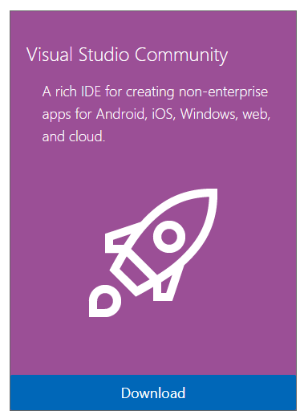
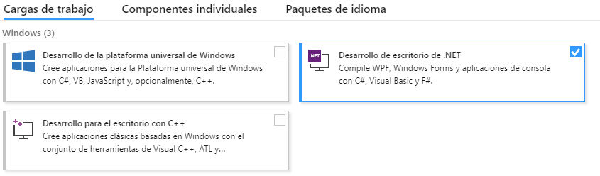

# C-Sharp-Introduction
Taller de introducción a C#

## Instalación de Visual Studio
En este taller usaremos <b>Visual Studio 2017</b>, podéis usar la versión Community de forma gratuita o Enterprise (si eres alumno de la UAL puedes pedir una cuenta Imagine y usar la versión Enterprise). Veamos cómo instalar Visual Studio Community:

Lo primero que haremos será irnos al siguiente enlace https://www.visualstudio.com/free-developer-offers/ y hacer click en Download en la opción de la izquierda, Visual Studio Community.

Una vez se haya descargado, lo ejecutaremos y tras esperar unos segundos, se abrirá una ventana en la que tenemos que seleccionar los paquetes que queremos instalar. Para este taller sólo necesitamos instalar el paquete de <b>Desarrollo de escritorio de .NET</b>, pero eres libre de instalar todos los que quieras para desarrollar por tu cuenta.

Seleccionamos la ubicación en la que queremos instalarlo y hacemos click en <b>Instalar</b>. Esperamos a que termine el proceso de instalación y ya tendríamos todo lo necesario para el taller.
